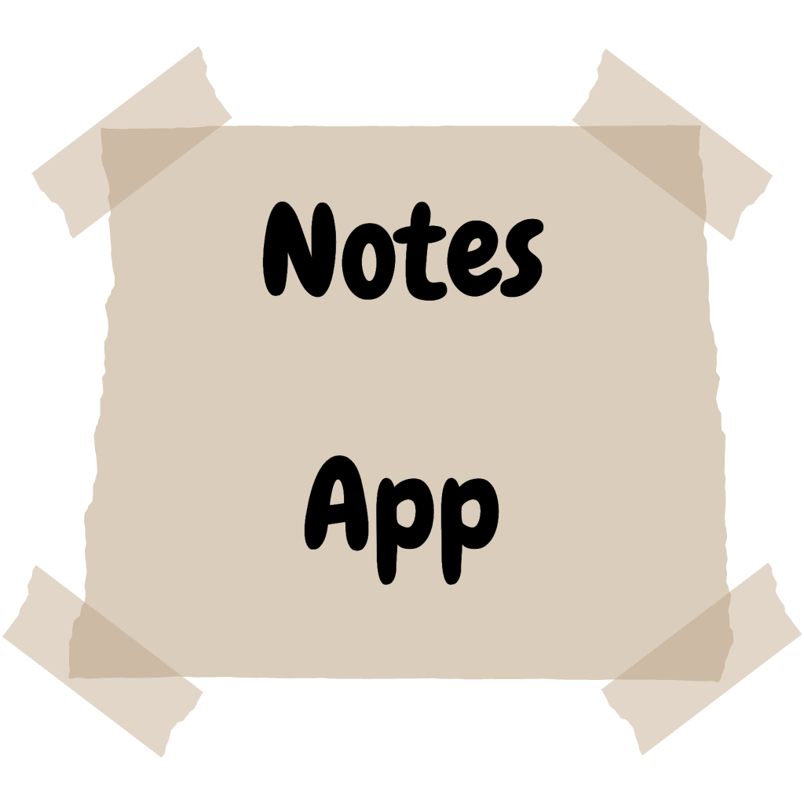
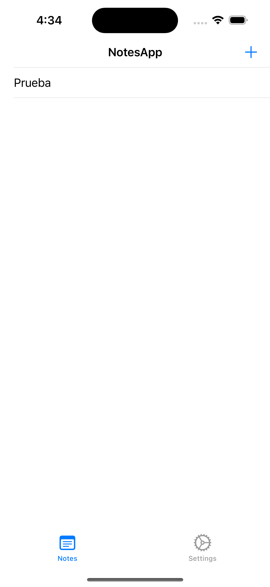
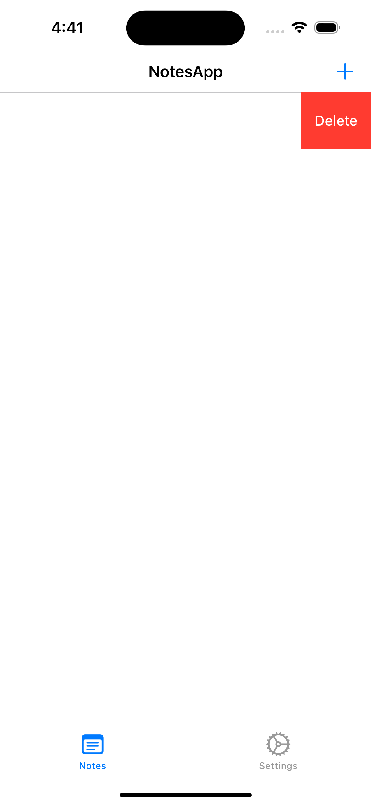
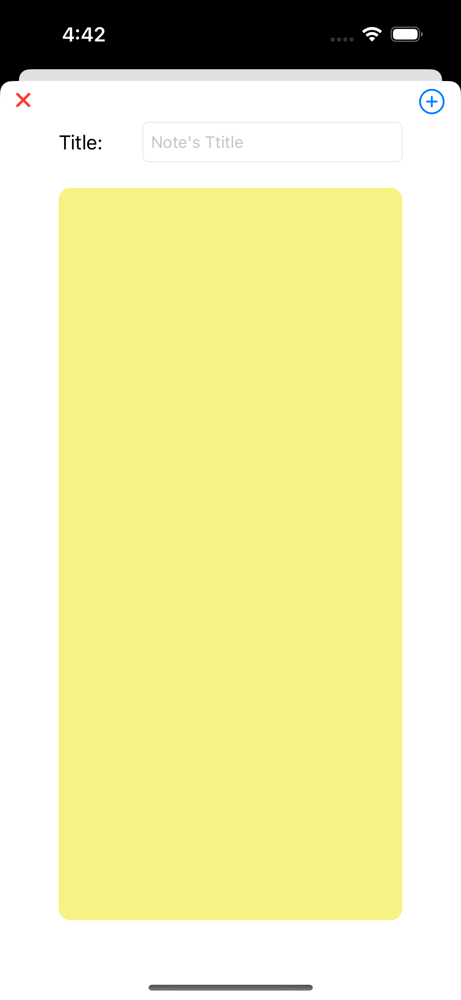
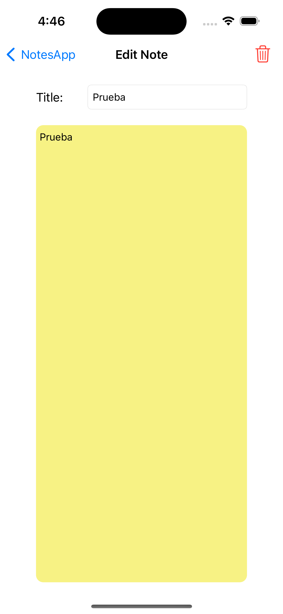
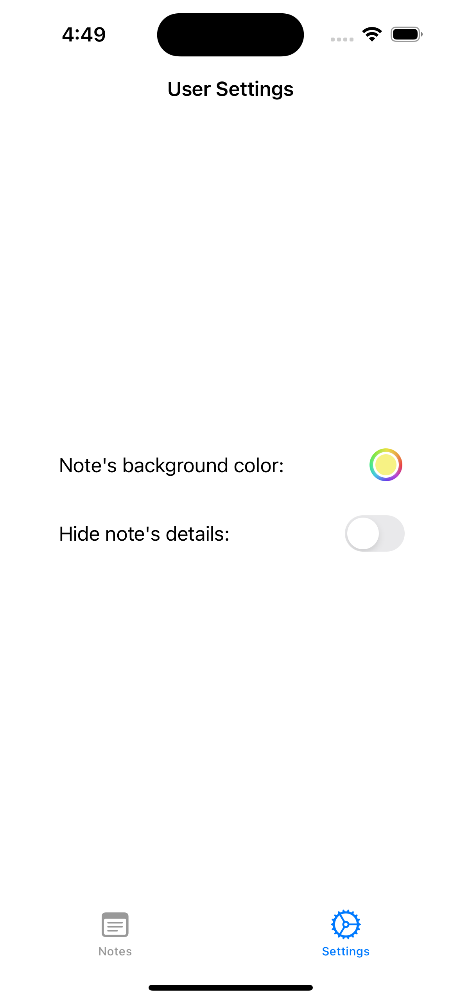
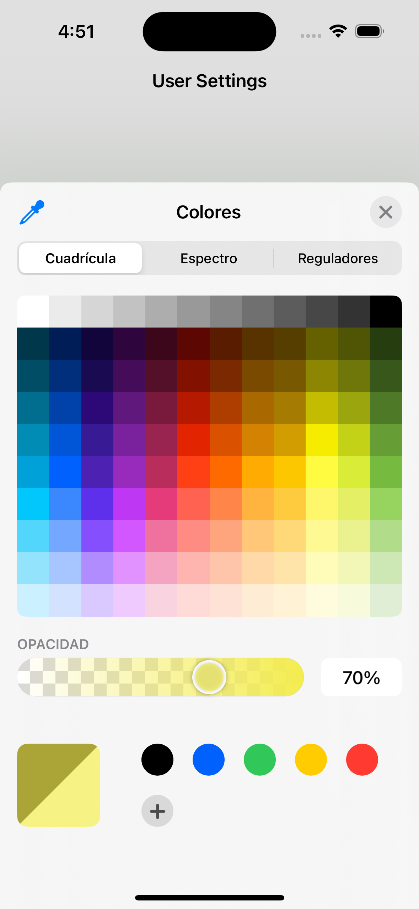

# Notes App
*Por: Brian Jiménez Moedano*

*Febrero 2023*

## Descripción

**Notes App** es una aplicación de *funcionalidad básica* pero de **diseño limpio, claro y robusto**. Mi principal **objetivo** al desarrollarla fue implementar una **arquitectura MVC claramente segmentada** haciendo de esta, una aplicación de fácil mantenimiento. También me enfoqué en dar una **buena experiencia de usuario**, al implementar tablas con animaciones, navegación a través de una TabBar y vistas ágiles a prueba de errores. Mi **motivación** al trabajar en este proyecto fue la de implementar diferentes **técnicas de persistencia de datos locales**, así como madurar **habilidades y buenas prácticas de programación** en Swift.

## Características

- **Aplicación utilitaria** para crear y gestionar notas personales.
- Diseño de arquitectura **MVC**.
- **Crea, edita y elimina** notas de texto personales.
- Cada nota tiene un **título** y un **cuerpo**.
- Permite **personalizar las vistas** con una **configuración de usuario persistente**.
- Persistencia de datos locales con **UserDefaults** para la configuración de usuario y **FileManager** para las notas.
- Gestión del modelo de datos de las Notas con un **UITableViewDiffableDataSource**, el cual ofrece una mejor experiencia de usuario.
- Navegación entre las notas y la configuración de usuario con un **UITabBar**.
- Navegación y transferencia de datos entre las vistas de las Notas por medio de **Segues**.
- Implementa un patrón de diseño de **Delegamiento**.

## Cómo Utilizarla

Al abrir la aplicación, el usuario podrá crear una nueva nota, editar las notas existentes, eliminarlas o personalizar la aplicación con sus preferencias de usuario:

1. **Pantalla Principal:** Desde esta pantalla el usuario puede visualizar las **notas que ha creado** en una **tabla dinámica** que responde a la selección de cada nota con un **toque**, navegando hacia la pantalla de **Edición**. Esta tabla también reconoce el **gesto de arrastre hacia la izquierda** para hacer una **eliminación de notas rápida**.

También puede crear una **nueva nota** con el botón de **+** ubicado en la barra de navegación superior. Finalmente, puede navegar hacia la configuración de usuario desde la barra de navegación inferior, dando un **toque** al ícono de *Settings*; y de vuelta a las notas dando un **toque** al ícono de *Notes*.

2. **Pantalla de Creación de Notas:** Desde esta pantalla el usuario puede ingresar un **título** y el **cuerpo de la nota** o simplemente dejarlas en blanco. Utilizando los botones de la parte superior izquierda y derecha, el usuario puede **cancelar** y **crear** la nota respectivamente. También es importante mencionar que la vista responde al **gesto de arrastre hacia abajo** para hacer una **cancelación de la nota rápida**.

3. **Pantalla de Edición:** Desde esta pantalla el usuario puede editar el **título** y/o el **cuerpo de la nota**. Simplemente con modificar alguno de los dos campos, la nota se **almacena automaticamente** al regresar a la vista principal, sin necesidad de confirmar los cambios. También es posible **eliminar** la nota con el **botón de basurero** ubicado en la barra de navegación superior.

4. **Pantalla de Configuración:** Desde esta pantalla el usuario puede **personalizar las vistas** eligiendo un **color para las notas** y/o **ocultando el cuerpo de las notas** en la tabla dinámica de la pantalla principal, consiguiendo una vista más **límpia y privada** de la misma.

## Tecnologías/Frameworks

- **UIKit:** Para el diseño de la interfaz de usuario.
- **Protocolos/Delegamiento:** Para las operaciones sobre el modelo de datos.
- **UserDefaults:** Para la persistencia de datos de la configuraicón de usuario.
- **FileManager:** Para la persistencia de datos de las notas.
- **UITableViewDiffableDataSource** Para la presentación del modelo de datos (notas).

## Licenciamiento

- **GNU GPLv3**
